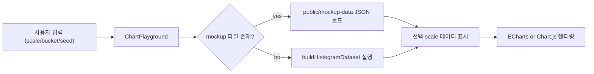

# 코드 읽기 가이드

이 문서는 이 프로젝트를 처음 보는 사람이 "어디부터, 무엇을, 왜" 봐야 하는지 빠르게 이해하도록 돕기 위한 안내서입니다.

## 1. 먼저 알아야 할 핵심 3줄

1. 이 프로젝트는 대규모 목업 데이터를 만들어 차트 성능을 비교하는 실습 앱입니다.
2. 차트는 ECharts/Chart.js를 바꿔가며 같은 데이터로 렌더링합니다.
3. 데이터는 `public/mockup-data`의 사전 생성 JSON을 우선 사용하고, 없으면 런타임에서 생성합니다.

## 2. 코드 읽는 순서 (이 순서대로 추천)

1. `src/app/page.tsx`
이 앱의 시작점입니다. 결국 `ChartPlayground`를 띄운다는 것만 먼저 확인하면 됩니다.

2. `src/components/charts/chart-playground.tsx`
프로젝트의 중심 화면입니다. 상태(스케일/버킷/시드), 데이터 로딩, 차트 렌더링 흐름이 모두 여기 있습니다.

3. `src/core/data-generator/build-histogram-dataset.ts`
실제 데이터 생성 로직입니다. "full-materialized vs sampled-stream" 분기와 집계 방식이 핵심입니다.

4. `src/types/chart-data.ts`
데이터 구조 정의입니다. 어떤 필드를 UI와 생성기가 주고받는지 확인할 수 있습니다.

5. `scripts/generate-mockup-data.ts`
사전 생성 파일을 만드는 스크립트입니다. 운영/테스트에서 생성 비용을 앞당기고 싶을 때 중요합니다.

6. `src/components/charts/bar-chart-echarts.tsx`, `src/components/charts/line-chart-echarts.tsx`, `src/components/charts/bar-chart-chart-js.tsx`, `src/components/charts/line-chart-chart-js.tsx`
최종 렌더링 레이어입니다. 데이터 구조를 어떻게 차트 옵션으로 연결하는지 보면 됩니다.

## 3. 전체 흐름 한눈에 보기



## 4. 꼭 이해해야 하는 포인트

1. `sampleSize = min(scale, 1_000_000)`
`build-histogram-dataset.ts`에서 가장 중요한 줄입니다. 스케일이 커도 최대 100만 샘플만 처리합니다.

2. `isApproximate`가 `true`면 `sampled-stream`
샘플 집계를 `scaleCountsToTarget`으로 확장해서 전체 규모를 근사합니다.

3. `records`는 전부 저장하지 않음
메모리 보호를 위해 최대 `MAX_RETAINED_RECORDS`만 보존합니다. 차트용 집계(counts)는 전체 샘플 기준입니다.

4. 화면은 스케일 전체를 한 번에 준비
`chart-playground.tsx`에서 현재 `seed/bucket`에 대한 모든 스케일 데이터를 미리 준비한 뒤, 스케일 전환은 캐시를 씁니다.

5. 사전 생성 파일 우선 로드
`public/mockup-data` 파일이 있으면 런타임 생성 비용이 줄고, 없으면 자동 fallback 생성됩니다.

## 5. 성능 이슈 볼 때 어디를 보면 되는가

1. 데이터 준비 시간
`generationMs`, `pipeline.timings`를 먼저 확인하세요.

2. 처리 모드
`pipeline.mode`가 `full-materialized`인지 `sampled-stream`인지 확인하세요.

3. 샘플 확장 배율
`sampleExpansionFactor`가 클수록 근사 성격이 강합니다.

4. 메모리 추정
`estimatedRecordBytes`, `estimatedScaleFootprintMb`를 확인하세요.

## 6. 실습 루틴 (초보자용)

1. `npm run dev`로 화면을 띄운다.
2. `1만 -> 5만 -> 10만` 순서로 올리며 생성 시간/처리 모드 변화를 본다.
3. `100만 -> 200만`에서 모드가 바뀌는지 확인한다.
4. `원시데이터 보기`를 켜서 `records[0]` 구조를 읽어본다.
5. 버킷 수(`40/80/120/160`)를 바꿔 집계 형태와 생성 시간 차이를 본다.

## 7. 사전 생성(mockup) 데이터 다루기

기본 생성:

```bash
npm run mockup:generate
```

옵션 예시:

```bash
npm run mockup:generate -- --seed=20260213 --bucket-counts=80 --keep-records=10
```

파일이 저장되는 위치:

- `public/mockup-data`
- `public/mockup-data/mockup-manifest.json`

## 8. 코드 수정할 때 안전 체크

1. `chart-data.ts` 타입을 바꿨다면 생성기/화면 모두 컴파일이 되는지 확인
2. `build-histogram-dataset.ts`를 수정했으면 샘플 확장 분기(`isApproximate`)를 함께 점검
3. `mockup` 파일명 규칙을 바꿨다면 스크립트와 UI 로더를 동시에 수정
4. 마지막으로 `npm run test`, `npm run lint` 실행
